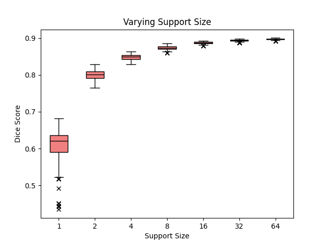
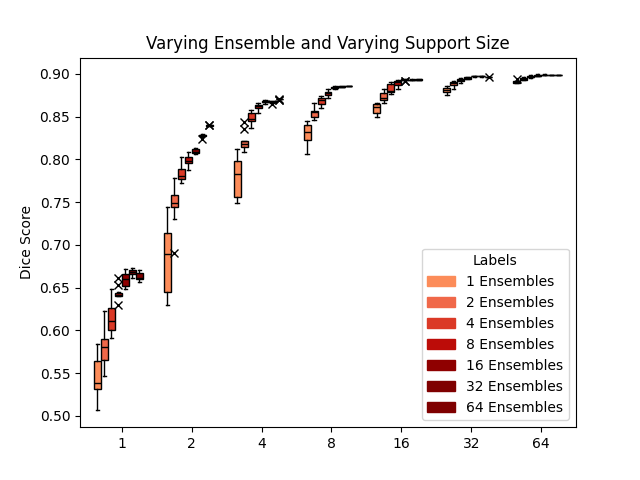

# VCA Project
 This repository contains the code to reproduce the results as a part of the Video Content Analysis course at IITH (Instructor: Prof. Dr. C Krishna Mohan) of the [paper](https://github.com/JJGO/UniverSeg).

## Requirements
- Download and follow setup instructions given in the [repository]((https://github.com/JJGO/UniverSeg)).
- `pip install tqdm einops`

## Dataset
- To run the `HAM.ipynb` download the HAM10000 dataset from [here](https://www.kaggle.com/kmader/skin-cancer-mnist-ham10000).
- To run codes relating to `WBC` the data processing can be done as given in this [repository](https://github.com/JJGO/UniverSeg/tree/main/example_data)

## Inference
- To get plots for different inference support sizes -> [Vary_support.py](./WBC/Vary_support.py)
- To get plots for different inference ensembles  -> [Vary_ensemble.py](./WBC/Vary_ensemble.py)
- To visualize some predictions -> [WBC.ipynb](./WBC.ipynb)

## Results
- For the python files the results are genereated in the `results` folder.

## Examples
- Varying support sizes

- Varying ensembles and support sizes

## Links to Slides
- [First Presentation](https://docs.google.com/presentation/d/1TuTGGDxj7wWLneUdWq3yXIGLL18HgmEvBsnvN-06QBc/edit#slide=id.p)
- [Final Presentation](https://docs.google.com/presentation/d/1Vf-jssFsCZUPQVR_dVo-Oq_ZGwgYBmGdlkTru2EIRA8/edit?usp=sharing)

## References and Citations
- [UniverSeg paper and code](https://universeg.csail.mit.edu/)
- [HAM10000 dataset](https://dataverse.harvard.edu/dataset.xhtml?persistentId=doi:10.7910/DVN/DBW86T)

